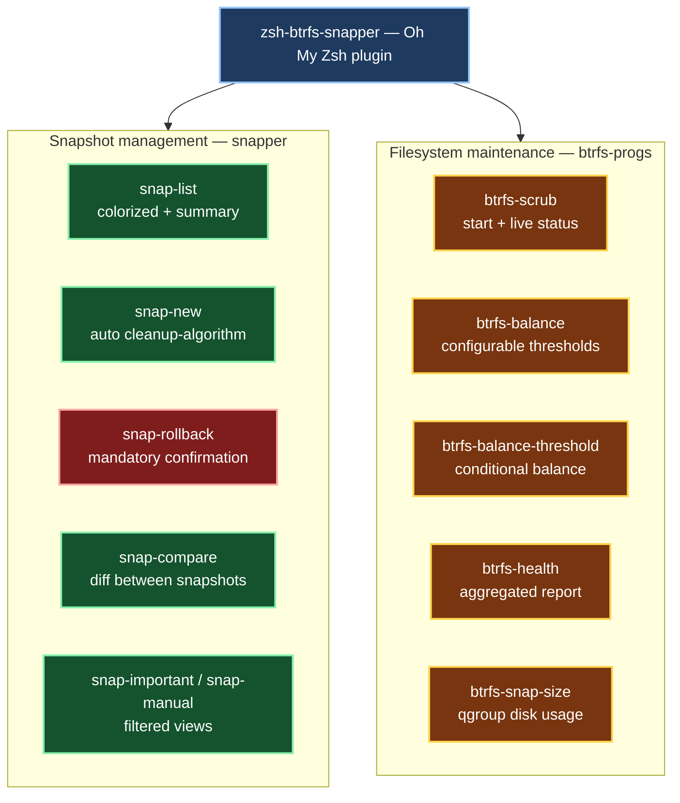

[](https://github.com/crisis1er/zsh-btrfs-snapper)


# zsh-btrfs-snapper

Oh My Zsh plugin for **btrfs** filesystem management and **snapper** snapshot control on openSUSE Tumbleweed — enriched commands, safety guards, and filtered views not available in native tools.

Deployed and validated on a live openSUSE Tumbleweed system.

---

## Architecture

<sub>⚠️ If the diagram is not visible, refresh the page — Mermaid rendering may take a moment.</sub>



---

## Requirements

- openSUSE Tumbleweed
- zsh 5.9+
- [Oh My Zsh](https://ohmyz.sh/)
- `btrfs-progs` — `sudo zypper install btrfs-progs`
- `snapper` — `sudo zypper install snapper`

---

## Installation

```zsh
git clone https://github.com/crisis1er/zsh-btrfs-snapper \
  ${ZSH_CUSTOM:-~/.oh-my-zsh/custom}/plugins/btrfs-snapper
```

Add `btrfs-snapper` to the plugins list in `~/.zshrc`:

```zsh
plugins=(... btrfs-snapper)
```

Reload:

```zsh
source ~/.zshrc
```

---

## Snapshot functions

| Command | Description |
|---|---|
| `snap-list` | Colorized snapshot list — current in green, important in yellow — with summary |
| `snap-new "description"` | Create snapshot with automatic `timeline` cleanup algorithm |
| `snap-del <id>` | Delete snapshot — displays list if no argument provided |
| `snap-rollback <id>` | Rollback with mandatory confirmation — displays list if no argument |
| `snap-compare <id1> <id2>` | Show files changed between two snapshots |
| `snap-important` | Display only `important=yes` snapshots |
| `snap-manual` | Display only manually created snapshots (excludes zypper/timeline) |
| `rollback-last` | Fast rollback to last snapshot — no confirmation, expert use |

### Multi-config aliases

| Command | Description |
|---|---|
| `snap-list-root` | List snapshots for config `root` |
| `snap-list-home` | List snapshots for config `home` |
| `snap-create-root "desc"` | Create snapshot in config `root` |
| `snap-create-home "desc"` | Create snapshot in config `home` |
| `snap-cleanup` | Run snapper cleanup (number algorithm) |
| `snap-cleanup-all` | Run snapper cleanup all |

---

## Btrfs functions

| Command | Description |
|---|---|
| `btrfs-scrub [mountpoint]` | Start scrub and display live status (default: `/`) |
| `btrfs-balance [dusage] [musage]` | Balance with configurable thresholds (default: 50%) |
| `btrfs-balance-threshold [%]` | Conditional balance — only runs if disk usage exceeds threshold (default: 75%) |
| `btrfs-snap-size` | Real disk space used by snapshots via btrfs qgroup |
| `btrfs-health` | Full report: filesystem usage + device errors + scrub status + snapshot summary |

### Scrub aliases

| Command | Description |
|---|---|
| `btrfs-scrub-status` | Show current scrub status |
| `btrfs-scrub-cancel` | Cancel running scrub |
| `btrfs-scrub-resume` | Resume paused scrub |

### Balance aliases

| Command | Description |
|---|---|
| `btrfs-balance-status` | Show current balance status |
| `btrfs-balance-pause` | Pause running balance |
| `btrfs-balance-resume` | Resume paused balance |
| `btrfs-balance-cancel` | Cancel running balance |

### Filesystem aliases

| Command | Description |
|---|---|
| `btrfs-df` | `btrfs filesystem df /` |
| `btrfs-usage` | `btrfs filesystem usage /` |
| `btrfs-show` | `btrfs filesystem show` |
| `btrfs-subvols` | List all subvolumes |
| `btrfs-stats` | Device error statistics |

---

## Design decisions

- **`btrfs-defrag` is intentionally excluded** — defragmentation breaks Copy-on-Write on btrfs and increases disk usage
- `snap-rollback` always requires confirmation — accidental rollbacks are irreversible
- `function name { }` syntax used throughout — prevents zsh alias/function conflicts on shell reload
- Paths use `/.snapshots/` — correct location on openSUSE (not `/mnt/.snapshots/`)
