[](https://github.com/crisis1er/zsh-manager)


# zsh-manager

Unified dispatcher hub for btrfs snapshot and filesystem management on openSUSE Tumbleweed. Central entry point coordinating the snapshot and maintenance plugin ecosystem.

---

## Architecture

```mermaid
flowchart TD
    classDef hub     fill:#1e3a5f,stroke:#93c5fd,stroke-width:2px,color:#ffffff
    classDef native  fill:#14532d,stroke:#86efac,stroke-width:2px,color:#ffffff
    classDef plugin  fill:#78350f,stroke:#fcd34d,stroke-width:2px,color:#ffffff
    classDef stub    fill:#374151,stroke:#9ca3af,stroke-width:1px,color:#d1d5db

    HUB[zsh-manager\nHub — unified dispatcher]:::hub

    HUB --> SNAPMAN[snap-man\nunified menu]:::native
    HUB --> SNAPHELP[snap-help\nall commands]:::native
    HUB --> SNAPDEL[snap-del\ndelete snapshot]:::native
    HUB --> SNAPCMP[snap-compare\ndiff two snapshots]:::native
    HUB --> SNAPIMP[snap-important\nfiltered view]:::native
    HUB --> SNAPMAN2[snap-manual\nfiltered view]:::native

    HUB -->|stub| SL[snap-list\nzsh-snap-list]:::plugin
    HUB -->|stub| SN[snap-new\nzsh-snap-new]:::plugin
    HUB -->|stub| SR[snap-rollback\nzsh-snap-rollback]:::plugin
    HUB -->|stub| BS[btrfs-scrub\nzsh-btrfs-scrub]:::plugin
    HUB -->|stub| BB[btrfs-balance\nzsh-btrfs-balance]:::plugin
    HUB -->|stub| BH[btrfs-health\nzsh-btrfs-health]:::plugin
```

<sub>⚠️ If the diagram is not visible, refresh the page — Mermaid rendering may take a moment.</sub>



---

## Requirements

- openSUSE Tumbleweed
- zsh 5.9+
- [Oh My Zsh](https://ohmyz.sh/)
- `snapper` — `sudo zypper install snapper`
- `btrfs-progs` — `sudo zypper install btrfs-progs`

---

## Recommended plugins

| Plugin | Role |
|---|---|
| [zsh-snap-new](https://github.com/crisis1er/zsh-snap-new) | guided snapshot creation |
| [zsh-snap-list](https://github.com/crisis1er/zsh-snap-list) | colorized snapshot listing |
| [zsh-snap-rollback](https://github.com/crisis1er/zsh-snap-rollback) | interactive rollback |
| [zsh-btrfs-scrub](https://github.com/crisis1er/zsh-btrfs-scrub) | btrfs scrub management |
| [zsh-btrfs-balance](https://github.com/crisis1er/zsh-btrfs-balance) | btrfs balance management |
| [zsh-btrfs-health](https://github.com/crisis1er/zsh-btrfs-health) | btrfs health report |

---

## Installation

```zsh
git clone https://github.com/crisis1er/zsh-manager \
  ${ZSH_CUSTOM:-~/.oh-my-zsh/custom}/plugins/zsh-manager
```

Add `zsh-manager` to the plugins list in `~/.zshrc`:

```zsh
plugins=(... zsh-manager)
```

Reload:

```zsh
source ~/.zshrc
```

---

## Native commands

| Command | Description |
|---|---|
| `snap-man` | Open the unified interactive dispatcher menu |
| `snap-help` | List all available commands across the hub and its plugins |
| `snap-del <id>` | Delete snapshot — displays list if no ID given |
| `snap-compare <id1> <id2>` | Show files changed between two snapshots |
| `snap-important` | Display only `important=yes` snapshots |
| `snap-manual` | Display only manually created snapshots (excludes zypper/timeline) |

### Multi-config aliases

| Command | Description |
|---|---|
| `snap-list-root` | List snapshots for config `root` |
| `snap-list-home` | List snapshots for config `home` |
| `snap-create-root "desc"` | Create snapshot in config `root` |
| `snap-create-home "desc"` | Create snapshot in config `home` |
| `snap-cleanup` | Run snapper cleanup (number algorithm) |
| `snap-cleanup-all` | Run snapper cleanup all |
| `rollback-last` | Fast rollback to last snapshot — no confirmation, expert use |

---

## Delegated commands (stubs)

If a plugin is not loaded, these functions display an install hint rather than failing silently.

| Command | Plugin required |
|---|---|
| `snap-list` | zsh-snap-list |
| `snap-new` | zsh-snap-new |
| `snap-rollback` | zsh-snap-rollback |
| `btrfs-scrub` | zsh-btrfs-scrub |
| `btrfs-balance` | zsh-btrfs-balance |
| `btrfs-balance-threshold` | zsh-btrfs-balance |
| `btrfs-snap-size` | zsh-btrfs-health |
| `btrfs-health` | zsh-btrfs-health |

---

## Short aliases

| Alias | Command |
|---|---|
| `man-s` | `snap-man` |
| `snap-l` | `snap-list` |
| `snap-n` | `snap-new` |
| `snap-r` | `snap-rollback` |
| `snap-d` | `snap-del` |
| `snap-c` | `snap-compare` |
| `snap-h` | `snap-help` |

---

## Manual

```zsh
man zsh-manager
```

The man page (`man/zsh-manager.1`) documents all commands, aliases, stubs, and requirements.
